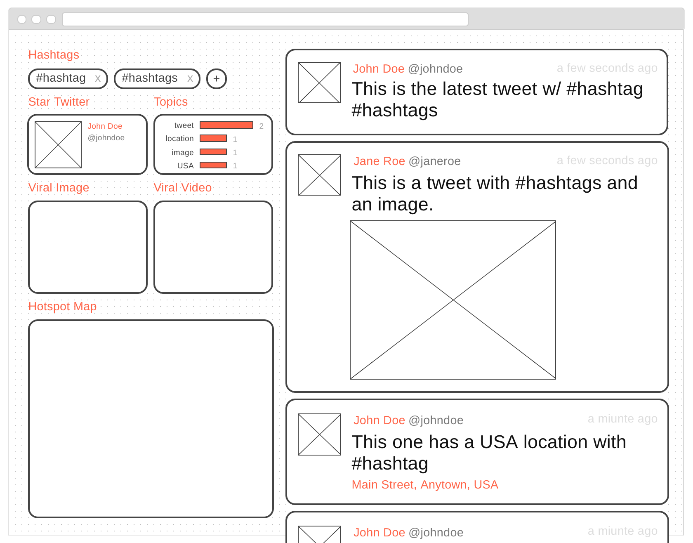

# App Design Document

## Objective 

Build a **Twitter Wall** web app in one week.

## Requirements 

- Using Angular2
- Displaying (directly) the lasted tweets (with images) containing certain hashtags (i.e. #Esri #EsriUC) when it is opened
- Beautifully designed 
- Showing information (e.g. popular topics)
- Using GitHub to show progress (no dumping)

## Procedures

0. Study Twitter APIs
1. Design functionalities 
2. Design wireframe / mockup 
3. Learn NodeJS and Angular 2
4. Setup GitHub and environment 
5. Implement app and compose documentations 
6. Debug issues 
7. Deploy app on Google Cloud Platform 
8. Debug and refactor 
9. Submit app and document 

## Functionalities

- Timeline
	- Clickable user
		- Profile image: `profile_image_url`, `profile_image_url_https`
		- Name: `user.name`
		- ID: `user.screen_name`
		- Verified: `user.verified`
	- Tweet text: `text`
	- Time: `created_at`, `timestamp_ms`
	- Media
- Information 
	- Hashtags (1+)
	- Star Twitter (1) (based on tagged tweet count)
		- Clickable user
			- Profile image: `profile_image_url`, `profile_image_url_https`
			- Name: `user.name`
			- ID: `user.screen_name`
			- Verified: `user.verified`
	- Topics 
		- Text
		- Count
		- Plot	
	- Virals (based on RT and RE count)
		- Photo
		- Video
	- *Hotspot Map* (OPTIONAL)
- *Responsiveness* (OPTIONAL)

## Wireframe

Dimension: 1024x768

[View it on Wireframe.cc](https://wireframe.cc/OPrqLi)
