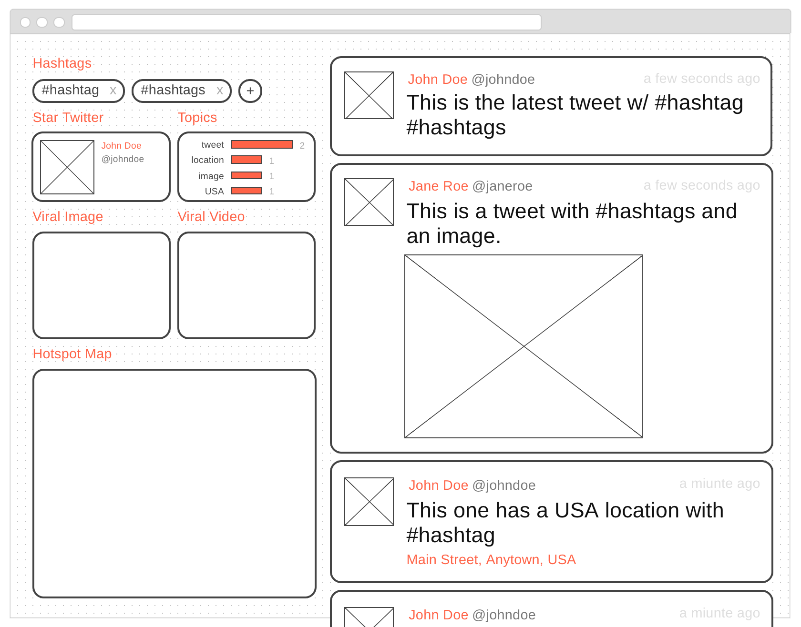
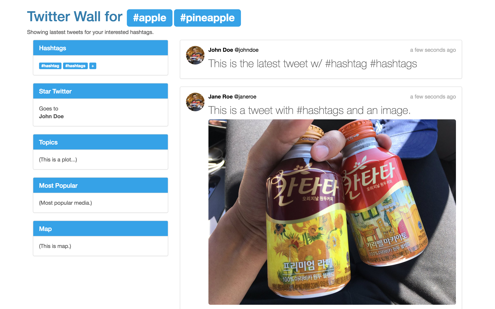
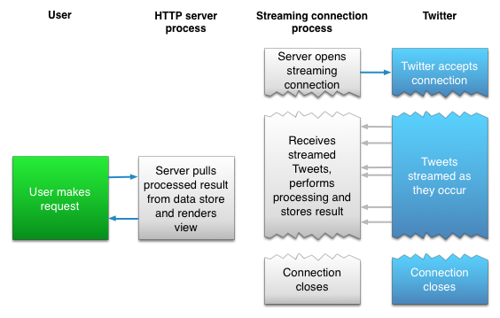

# App Design Document

## Objective 

Build a **Twitter Wall** web app in one week.

## Requirements 

- Using Angular 2
- Displaying (directly) the lasted tweets (with images) containing certain hashtags (i.e. #Esri #EsriUC) when it is opened
- Beautifully designed 
- Showing information (e.g. popular topics)
- Using GitHub to show progress (no dumping)

## Procedure

| # | Task | Date |
|---:|---|:---|
| 1 | Study Twitter APIs | 6/27 |
| 2 | Study competitions | 6/27, 6/28 |
| 3 | Design functionalities | 6/28 |
| 4 | Design wireframe / mockup | 6/28 |
| 5 | Learn Node.js, TypeScript, and Angular 2 | 6/28, 6/29 |
| 6 | Setup GitHub and environment | 6/30 |
| 7 | Implement app and compose document  | 6/30, 7/1, 7/2 |
| 8 | Test, debug, and refactor  | 7/2, 7/3 |
| 9 | Deploy app on Google Cloud Platform  | 7/4 |
| 10 | Submit app and document  | 7/4 |

## Functionalities

### Timeline
- Clickable user
	- Profile image: `profile_image_url`, `profile_image_url_https`
	- Name: `user.name`
	- ID: `user.screen_name`
	- Verified: `user.verified`
- Tweet text: `text`
- Time: `created_at`, `timestamp_ms`
- Media

### Information 

- Hashtags (1+)
- Star Twitter (1) (based on tagged tweet count)
	- Clickable user
		- Profile image: `profile_image_url`, `profile_image_url_https`
		- Name: `user.name`
		- ID: `user.screen_name`
		- Verified: `user.verified`
- Topics 
	- Text
	- Count
	- Plot	
- Most Popular Media (based on RT and RE count)
	- Photo
	- Video

### (Future Features)
- Hotspot Map
- Responsiveness
- Pin-to-Top
- Editable hashtags

## Wireframe and Mockup
### Wireframe
Dimension: 1024x768 [View it on Wireframe.cc](https://wireframe.cc/OPrqLi)

### Mockup
Dimension: 1024x700

## Architecture Design

### API

Since this app is trying to display the latest tweets containing **specified** hashtags in a **real-time** fashion, [Twitter **Streaming** API](https://dev.twitter.com/streaming/overview), particularly, [**Public** Streams API](https://dev.twitter.com/streaming/public)'s [POST](https://dev.twitter.com/streaming/reference/post/statuses/filter) method with [track](https://dev.twitter.com/streaming/overview/request-parameters#track) parameter is the one to utilize. 

For example, if we want to stream tweets containing both or either of two hashtags `#hashtag1` and `#hashtag2`, then concatenate them with `,` and take it as the value of `track`.

	client.stream('statuses/filter', {track: '#hashtag1,#hashtag2'},  function(stream) {
	  stream.on('data', function(tweet) {
	    console.log(tweet.text);
	  });
	  stream.on('error', function(error) {
	    console.log(error);
	  });
	});
	
where `client` is an instance of `Twitter`:

	var Twitter = require('twitter');
	
	var client = new Twitter({
	  consumer_key: process.env.TWITTER_CONSUMER_KEY,
	  consumer_secret: process.env.TWITTER_CONSUMER_SECRET,
	  access_token_key: process.env.TWITTER_ACCESS_TOKEN_KEY,
	  access_token_secret: process.env.TWITTER_ACCESS_TOKEN_SECRET
	});

Therefore, once a user wants to update the combination of hashtags, let's say, add a new one `hashtag3`, then the stream has to be stoped and reconnect the stream with

	 {track: '#hashtag1,#hashtag2,#hashtag3'} 

Unfortunately, there is a rate limit of Streaming API: if the client has connected too frequently, a `420` code will be returned for `Rate Limited` and the only thing to do is wait. As a result, **a hot-update for hashtags will not be practicable**, unless a user's update operation frequency is restricted on front-end. 

To make the implementation approachable, for now, hashtags will be **fixed** as server runs. 

### Architecture

According to [Twitter API doc](https://dev.twitter.com/streaming/overview#differences-between-streaming-and-rest),

> ... the code for maintaining the Streaming connection is typically run in a process separate from the process which handles HTTP requests:
> 
> 
> 
> The streaming process gets the input Tweets and performs any parsing, filtering, and/or aggregation needed before storing the result to a data store. The HTTP handling process queries the data store for results in response to user requests.

this app should be composed of three parts as follows:

1. Front-end in Angular 2
2. Server
3. Data store

Front-end will keep requesting latest tweets from server, and displaying the response properly to user; Server will keep processing the streaming tweets (containing a fixed set of hashtags, as discussed above) and saving them in proper format so that server can respond to front-end as needed. Thus, a database is needed for multiple clients accessing to the data in the same period of time (otherwise, the number of connections to the Twitter API will soon reach the limit for one credential). As a consequence, when the app launches in users' browsers at different times, the users should see the same at the same moment.

To make the implementation more approachable, for now (before it is published as a real product), let's establish a new connection to Twitter API **every time** the app is launched. After that, we bring database into play.
