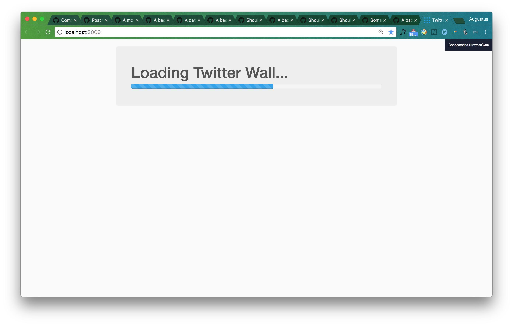
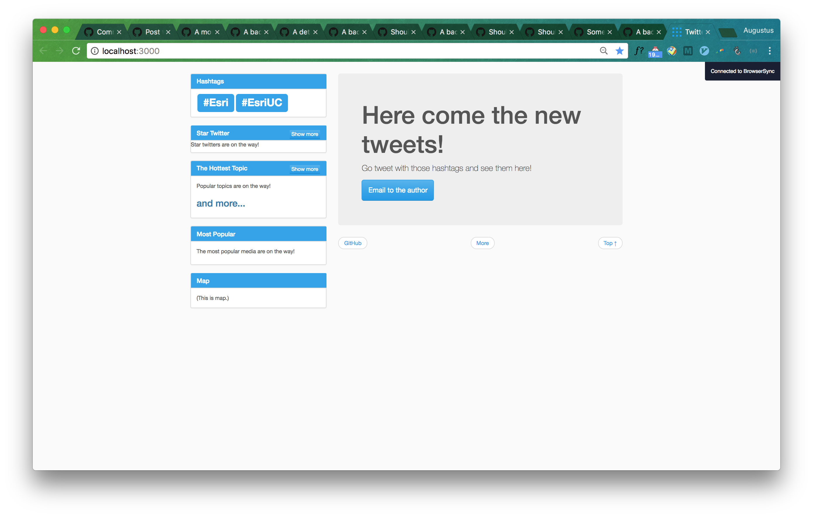
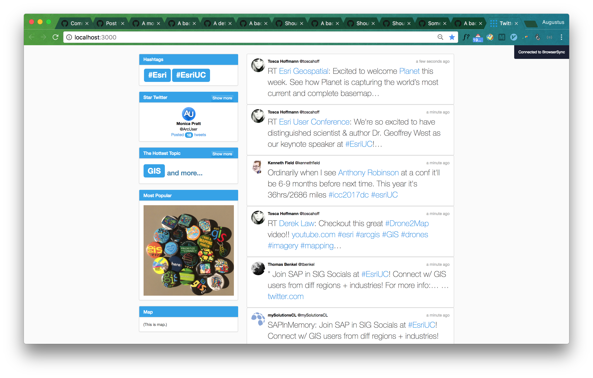
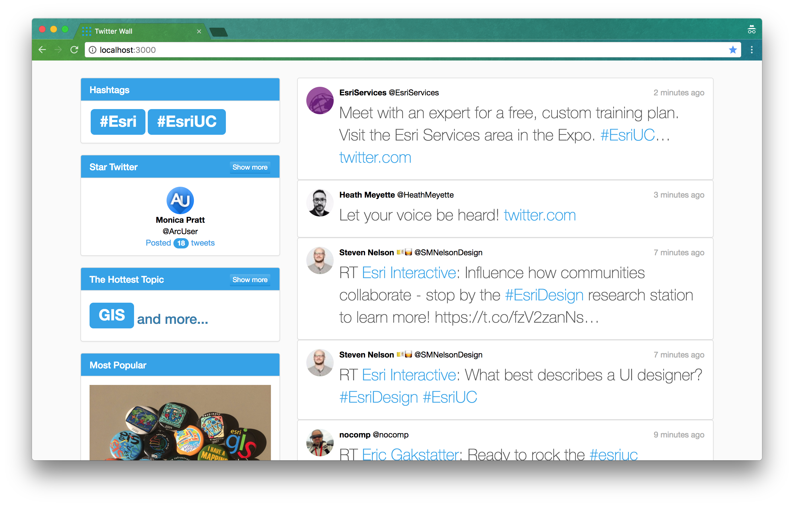
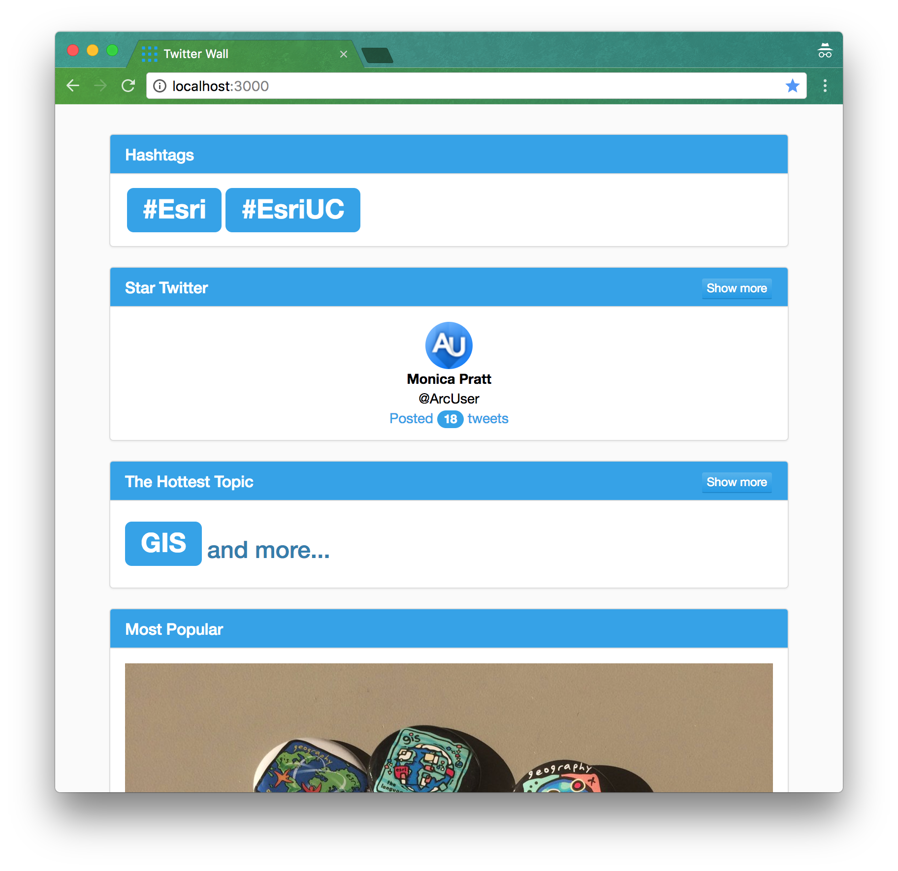
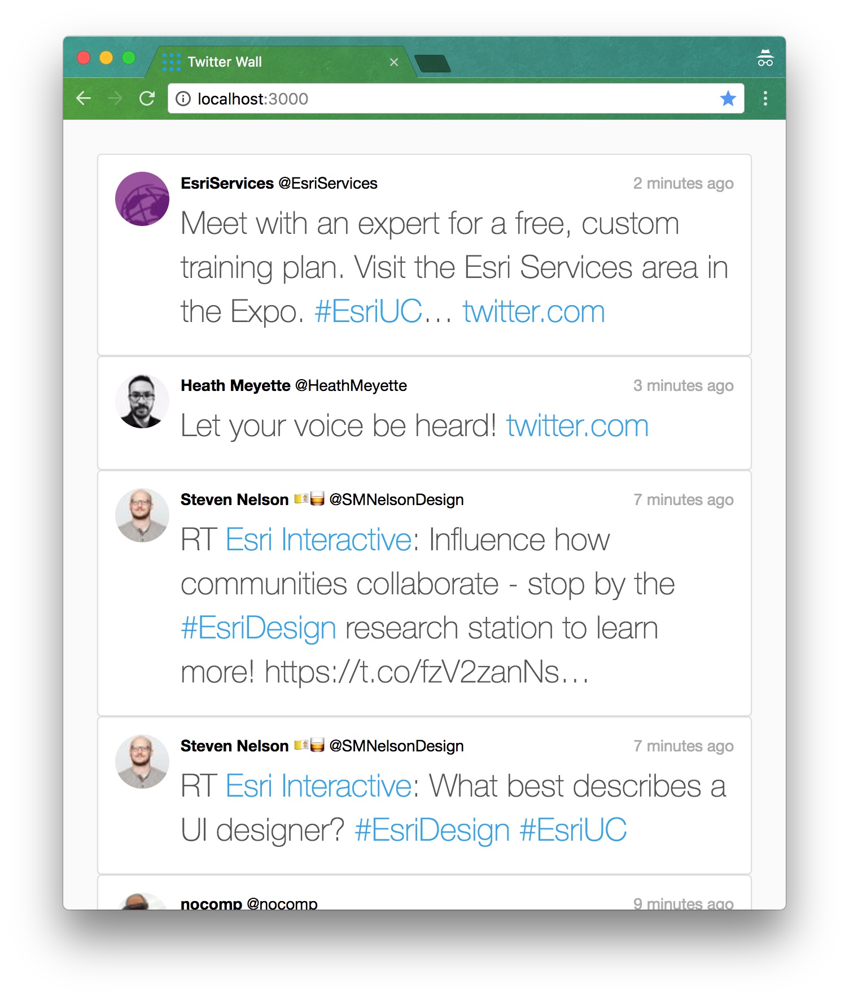

# App Design Document

## Objective 

Build a **Twitter Wall** web app in one week.

## Requirements 

- [x] Using Angular 2
- [x] Displaying (directly) the latest tweets (with images) containing certain hashtags (i.e. `#Esri` `#EsriUC`) when it is opened
- [x] Beautifully designed 
- [x] Showing information (e.g. popular topics)
- [x] Using GitHub to show progress (no dumping)

## Procedure

| # | Task | Date |
|---:|---|:---|
| 1 | Study Twitter APIs | 6/27 |
| 2 | Study competitions | 6/27, 6/28 |
| 3 | Design functionalities | 6/28 |
| 4 | Design wireframe / mockup | 6/28 |
| 5 | Learn Node.js, TypeScript, and Angular 2 | 6/28, 6/29 |
| 6 | Setup GitHub and environment | 6/30 |
| 7 | Implement app and compose document  | 6/30, 7/1, 7/2, 7/3 |
| 8 | Reconstruct project folder | 7/4 |
| 9 | Refine frontend UI -- Dashboard | 7/5 |
| 10 | Refine frontend UI -- Timeline | 7/5 |
| 11 | Rebuild backend and frontend with new data exchange pattern`socket.io` | 7/6 |
| 12 | Migrate to V4 | 7/6 |
| 13 | Add animations  | 7/7 |
| 14 | Make Demo video  | 7/7 |
| 15 | Submit app and document  | 7/7 |

## Implemented Functionalities

> `-->`: click and jump to

### Timeline (on right)
 
- Launch
	- Loading page with (dummy) progress bar	
		
		
	- "Fetch on Launch": fetch those tweets (20, determined by server's `protionSize` in `config.js`) clients just miss out before clients launch, if any	
		
	
	- No animation for displaying missed tweets **vs** animation for new newly streamed tweets
			
		
- Clickable user (see image below)
 	- Profile image --> user's profile page
	- Name --> user's profile page
	- ID --> user's profile page
	- <s>Verified: `user.verified`</s>
- Clickable tweet
	
		
	-  Tweet exclusive area (panel) --> original tweet on Twitter
	-  Posted time --> original tweet on Twitter
	-  Tweet entities
		-  URLs --> original target
		-  mentions --> mentioned user's profile page
		-  hashtags --> hashtags search results on Twitter
		-  media --> original tweet on twitter
- Special links
	- `GitHub`
	- `More` --> search results on hashtags on Twitter
	- `Top` --> the top go the page
- Remove old tweets on Timeline
	- always keep tweets under certain number 

### Information  / Dashboard (on left)
- Launch
	- "Fetch on Launch": fetch most recent ranking information from server, if any
- Hashtags 
	- Not editable  
- Star Twitter (1 OR 5) (based on tagged tweet count)
	-  <kbd>Show more</kbd> / <kbd>Show less</kbd> button with dynamic header text
	- Clickable user --> profile page
	- Clickable numbers of posts --> profile page
	- animation for showing more
- Topics 
	-  <kbd>Show more</kbd> / <kbd>Show less</kbd> button with dynamic header text
	- Number of appearance 
 	- Animation for "showing more" 
	- Clickable topic --> Twitter search result
	- blacklist filtering (actually done on server side)
- Most Popular Media (based on RT and Like count)
	- Clickable Photo --> original tweet
	- <s>Video</s> (not available in streaming API)

### Responsiveness

- Hide information panels when screen is small

	
	
	
	

### (Future Features)
- Hotspot Map
- <s>Responsiveness</s> *implemented*
- Pin-to-Top
- Editable hashtags

## Wireframe and Mockup
### Wireframe
Dimension: 1024x768 [View it on Wireframe.cc](https://wireframe.cc/OPrqLi)

### Mockup
Dimension: 1024x700

## <s>Architecture Design</s>

### API

Since this app is trying to display the latest tweets containing **specified** hashtags in a **real-time** fashion, [Twitter **Streaming** API](https://dev.twitter.com/streaming/overview), particularly, [**Public** Streams API](https://dev.twitter.com/streaming/public)'s [POST](https://dev.twitter.com/streaming/reference/post/statuses/filter) method with [track](https://dev.twitter.com/streaming/overview/request-parameters#track) parameter is the one to utilize. 

For example, if we want to stream tweets containing both or either of two hashtags `#hashtag1` and `#hashtag2`, then concatenate them with `,` and take it as the value of `track`.

	client.stream('statuses/filter', {track: '#hashtag1,#hashtag2'},  function(stream) {
	  stream.on('data', function(tweet) {
	    console.log(tweet.text);
	  });
	  stream.on('error', function(error) {
	    console.log(error);
	  });
	});
	
where `client` is an instance of `Twitter`:

	var Twitter = require('twitter');
	
	var client = new Twitter({
	  consumer_key: process.env.TWITTER_CONSUMER_KEY,
	  consumer_secret: process.env.TWITTER_CONSUMER_SECRET,
	  access_token_key: process.env.TWITTER_ACCESS_TOKEN_KEY,
	  access_token_secret: process.env.TWITTER_ACCESS_TOKEN_SECRET
	});

Therefore, once a user wants to update the combination of hashtags, let's say, add a new one `hashtag3`, then the stream has to be stoped and reconnect the stream with

	 {track: '#hashtag1,#hashtag2,#hashtag3'} 

Unfortunately, there is a rate limit of Streaming API: if the client has connected too frequently, a `420` code will be returned for `Rate Limited` and the only thing to do is wait. As a result, **a hot-update for hashtags will not be practicable**, unless a user's update operation frequency is restricted on front-end. 

To make the implementation approachable, for now, hashtags will be **fixed** as server runs. 

### Architecture

According to [Twitter API doc](https://dev.twitter.com/streaming/overview#differences-between-streaming-and-rest),

> ... the code for maintaining the Streaming connection is typically run in a process separate from the process which handles HTTP requests:
> 
> 
> 
> The streaming process gets the input Tweets and performs any parsing, filtering, and/or aggregation needed before storing the result to a data store. The HTTP handling process queries the data store for results in response to user requests.

this app should be composed of three parts as follows:

1. Client 
2. Server 
3. Data store 

The server is running all the time (no stopping and starting) with fixed keywords (for now). While the server gets back stream results, a few more values (for the things needed for the front end) should be also calculated and stored in memory (data store). <s>When the clients connect to the backend, the server provides a `GET` request connection with appropriate JSON needed for front end. In this way, it is not possible to reach the limit for one credential.</s> As a consequence, when the app launches in users' browsers at different times, the users should see the same at the same moment.

### <s>Data Communication</s> 

- **Twitter API --> Server**: A Streaming API's [tweet JSON](https://dev.twitter.com/overview/api/tweets) is taken **untouched** when prepended into the `tweetsData` array on server. 

- **Client --> Server**: When frontend requests latest tweets, it passes an `index` indicating that the latest tweet the frontend has is `tweetsData[index - 1]`. The parameter of the very **first** request since a client is launched will be: 

		{
			index: 0
		} 
		
	so that all tweets on server can be fetched (which is actually not necessary).

- **Server --> Client**: The server only needs to pick up where this client left off and sends back an **incremental update** JSON as well as ranking information. See more details in the section of **JSON Fields Spec** below.
	
## <s>JSON Fields Spec</s>

Overview:

	{
		"success": true,
		"tweets": {
			"index": 0,
			"data": []
		},
		"ranks": {
			"user_ranks": [],
			"topic_ranks": [],
			"media_ranks": []
		}
	}

| Field | Type | Description |
|:---|:---|:---|
| `success` | Boolean | |
| `tweets` | Object | Data for tweets shown in timeline |
| `tweets.index` | Number | `tweetsData.length`, updated client's index |
| `tweets.data` | Array |  Array of `tweet` object, standing for newly posted tweets since last time |
| `tweets.data[i].is_orginal` | Boolean | Indicating if tweet `data[I]` is original (rather than retweeting or quoting). Calculated as `!(retweeted_status OR quoted_status)` (these two fields are from [Twitter `tweet` object](https://dev.twitter.com/overview/api/tweets) |
| `ranks` | Object | Ranking information to show in dashboard |
| `ranks.user_ranks` | Array | Array of `user_rank` object, 5 most active twitters |
| `ranks.user_ranks.count` | Number | The number of posts **the user** posted with targeted hashtags |
| `ranks.user_ranks.user` | Object | **The** `user` |
| `ranks.topic_ranks` | Array | Array of `topic_rank` object, 5 most popular topics | 
| `ranks.topic_ranks.count` | Number | The number of **the topic** |
| `ranks.topic_ranks.topic` | String | **The topic** |
| `ranks.media_ranks` | Array | Array of `media_rank` object, 1 most popular media |
| `ranks.media_ranks.weight` | Number | `weight = retweet_count * 2 + favorite_count` |
| `ranks.media_ranks.media` | Array | [Twitter's standard `media` array](https://dev.twitter.com/overview/api/entities#media) |

Samples: 

### `user`

Here is a sample `user` JSON (condensed from [Twitter's `user` object](https://dev.twitter.com/overview/api/users)):

	{
		"name": "Yankuan",
		"screen_name": "vv4t",
		"verified": false,
		"profile_image_url": "http://pbs.twimg.com/profile_images/758106920645296128/uTuvtC4A_normal.jpg"
	}

it is used as `ranks.user_ranks[i].user` as well as `tweets.data[i].user`.

### `user_rank`

Sample object:

	{
		"count": 14,
		"user": {}
	}

where `user` is the one right above.

### `topic_rank`

Sample object:

	{
		"count": 14,
		"topic": "arcgis"
	}

### `media_rank`

Sample object:

	{
		"weight": 20,
		"media": []
	}

where `media` is the [Twitter's standard `media` array](https://dev.twitter.com/overview/api/entities#media).

### `tweet`

Then let's see a sample `tweet` JSON (condensed from [Twitter `tweet` object](https://dev.twitter.com/overview/api/tweets)):

	{
		"created_at": "Sun Jul 02 20:54:00 +0000 2017",
		"id": 881616970805780500,
		"text": "#esri #EsriUC https://t.co/K6P6bLUY4I",
		"display_text_range": [],
		"user": {},
		"is_orginal": true,
		"entities": {},
		"lang": "und",
		"timestamp_ms": "1499028840148"
	}

all fields are the same as those in Twitter's definition, except for `is_orginal`.

## Architecture Re-design (with `socket.io`)

### API 

Using the previous one. Meanwhile, there is a node package `node-tweet-stream` doing the same thing. 

### Architecture

Now, each component is only responsible for its own data and does its own communication with server. 

### Data communication 

Two parts of communications:

1. Server emitting new streamed tweets and new rankings -- `socket.io` & `ng2-socket-io`
	- Once there is  a tweet streamed to server, separately update ranking information locally, and 
	- Emit new tweet (a more succinct `tweet[]`, see below) as well as one or more updated rankings if necessary (same data structure as that in previous design: `user_rank[]`, `topic_rank[]`, `media_rank[]`) 
	
	        tweet: {
	            created_at: tweet.created_at,
	            id_str: tweet.id_str,
	            text: tweet.text,
	            display_text_range: tweet.display_text_range,
	            user: condensers.condenseUser(tweet.user),
	            is_original: !(!!tweet.retweeted_status || !!tweet.quoted_status),
	            entities: tweet.entities,
	            timestamp_ms: tweet.timestamp_ms
	        }
	        
	- Events:
		- `new tweet`
		- `user rank`
		- `topic rank`
		- `media rank`
2. Client fetching missed tweets and latest rankings -- `GET` method
	-  "Fetch on Launch"
	-  On `/missed` 
		- query field name `what`
		- query value can be one of 
			- `mt`: missed tweets
			- `user`
			- `topic`
			- `media`
	
---
# What I learned in the past two weeks

## Language

- Typescript 
- ECMAScript 2015

## Frameworks

- Angular 2 / 4 
- Node.js 

## Techniques 

- Quickly setup as server in any folder with `node` / `lite-server`
- Keep serving for development with `node-dev` / `ng serve --open`
- Plunker -- online Angular environment 
- Pass sensitive variables (such as keys and secrets) as `process.env.*` to programs
- Realtime communication package `socket.io` with `ng2-socket-io`
- Visual Studio Code
- Mock data API streaming with collected data so that API rate limit will not be easily reached

## Other

- How to design data communication interfaces / data structures 
- How to separate work / data of client and server
- How to build a medium size web app with state-of-art techniques from scratch 
- First start with naive solution and then iterate to better one

---
# What I can do better next time

 - (Should) start with style guide for both coding and project folder structure   
 - (Should) better balance in working and resting
 

